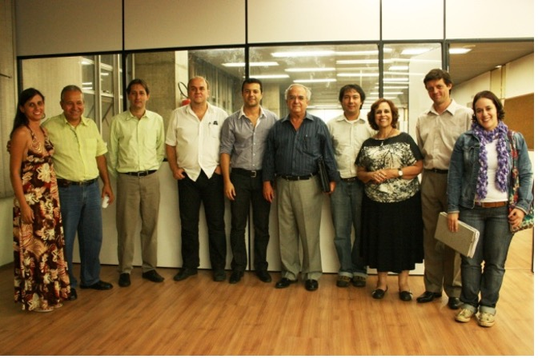

# Eu e CEFET

No final de 2005 recebi um email da professora *Heloísa Maria Barbosa*
do Departamento de Engenharia de Transportes e Geotecnia da UFMG. Ela
escreveu para me informar sobre um concurso que estava para ser
realizado no CEFET-MG, para a área de transportes. Eram duas vagas e fiz
inscrição despretenciosamente, pois a bibliografia para o concurso era
muito orientada à engenharia de tráfego. Decidi não me preparar para o
concurso, pois o prazo era exíguo e eu não conseguiria me organizar para
estudar. Apostei na ideia de que somos preparados ao longo da formação
acadêmica. E deu certo! Fiz a prova teórica, fiquei em segunda colocação
depois de escrever mais de 20 laudas. Entreguei a documentação e
sorteiei meu tema para a prova didática: Projetos Viários. Heloísa era
um dos membros da banca e tinha sido minha professora desse conteúdo
especificamente. Como eu poderia ministrar uma aula para minha
professora de um assunto que ela me ensinara e sobre o qual eu não tinha
me especializado?

Resolvi concentrar meus esforços na organização pedagógica da aula,
elaborando um plano de aula estruturado e destacando muito mais a
proposta do que o conteúdo. Naquele momento eu já tinha alguns anos de
experiência como professora, apesar de nenhuma qualificação formal
docente. Acho que a aula foi boa, pois fui aprovada para uma das vagas
e, no dia 10 de fevereiro de 2006, tomei posse.

Ingressei no CEFET-MG na coordenação de curso técnico em Transporte e
trânsito. Não éramos um departamento. Éramos duas coordenações de curso
que contemplavam o técnico em Transportes e Trânsito e o técnico em
Estradas cada uma. Tudo era novidade. Desde a ideia de lecionar para
adolescentes (eu me sentia e até hoje me sinto adolescente), até a
estrutura de uma Instituição de Ensino pública. Prontamente recebi o
cargo de coordenação de laboratórios dos cursos, o que me proporcionou
uma aprendizagem rápida sobre como funcionava a gestão institucional, os
processos de compras e pregões, a gestão da demanda por insumos
laboratoriais. Há alguns anos não via um aparelho de Casagrande
(confesso que precisei pesquisar o nome para escrevê-lo aqui!) e
precisei reaprender um pouco daquele universo da geotecnia e conhecer
implementações em asfaltos, infra e superestrutura viária. Por meio
dessa atuação como coordenadora de laboratório conheci muitas pessoas na
instituição. Conheci a estrutura organizacional. Naquela época ainda
havia pouca formalização dos processos institucionais e, portanto, as
relações pessoais eram essenciais para que os processos fossem
executados. Não havia digitalização dos meios de formalização das
demandas e dos posicionamentos institucionais e pouca alocação de
recursos humanos dedicados às funções administrativas. Nós,
coordenadores, éramos responsáveis por redigir atas, memorandos,
distribuir documentos fisicamente pelo campus. Confesso que essa
pessoalidade e a morosidade na condução dos processos administrativos me
incomodaram bastante, e tudo o que pude "digitalizar" dentro da
coordenação, o fiz.

Logo passei a ser coordenadora do curso de Estradas e em seguida de
Transportes e Trânsito. Exerci alguma função de coordenação até 2009,
quando gozei licença maternidade. Dentre as atividades administrativas
que já exerci, a coordenação de cursos é a mais interessante. Ela
contempla a participação ativa em órgãos colegiados responsáveis pelas
discussões pedagógicas e curriculares. Aprendi muito sobre como
funcionam as referências curriculares nacionais para o ensino
profissional e tecnológica e como são base para a construção da
estrutura dos cursos técnicos. Discuti institucionalmente e construi
argumentações para o MEC com foco na necessidade de adequação do curso
técnico em Transportes e Trânsito ao Catálogo Nacional de Cursos
Técnicos (e vice-versa). Fiz inúmeras reuniões com estudantes e
familiares na busca de soluções para as dificuldades familiares e
pessoais em relação à instituição.

Como docente, nesse período entre 2006 e 2016[^eu_e_cefet-1], lecionei
essencialmente nos cursos técnicos da coordenação que tornou-se
Departamento de Engenharia de **Transportes** a partir da implementação
do curso de Engenharia de **Transportes**. Ministrei, de maneira
consistente, as disciplinas "Gerenciamento de Transportes de Carga",
"Operação de Transportes de Cargas", "Políticas e Planejamento de
Transportes" e "Administração" para os cursos técnicos.

[^eu_e_cefet-1]: Houve períodos de licença maternidade em 2009 e 2012 e
    o período de licença para capacitação entre 2011 e 2014 nesse
    período.

Em 2008 elaboramos e implementamos a reestruturação dos cursos técnicos
integrados, e as disciplinas tornaram-se anuais, com alteração da
estrutura curricular dos cursos. As disciplinas dos cursos técnicos na
modalidade concomitância externa e subsequente (quando o estudante não
cursa o ensino médio de maneira integrada ao ensino profissionalizante)
eram ofertadas no turno noturno e a estrutura curricular não sofreu
alterações importantes. Entretanto, para os cursos intergados diurnos
(ensino médio profissionalizante), as disciplinas que passei a ministrar
foram denominadas "Logística", "Transporte de Cargas Eventualmente
ministrei algumas disciplinas para a Engenharia de Produção Civil, como
"Distribuição Física de Produtos e Layout" e "Logística".

Em novembro de 2009 deixei as funções de coordenação de
cursos/laboratórios para ser mãe. Imersa na licença maternidade, me
ausentei de todas as atividades profissionais e acadêmicas. Naquele ano,
antes da licença, participei da comissão de reestruturação do projeto
político-pedagógico do curso de Engenharia de Transportes, que foi
aprovado institucionalmente em 2012 (\@ref(fig:eng)). Era um projeto
muito especial, especialmente por se tratar de mais uma oferta de cursos
de engenharia gratuitos noturnos, se consolidando como uma síntese dessa
área de conhecimento na formação de profissionais e num processo de
inclusão devido ao acesso a estudantes que precisam trabalhar.

```{r eng, echo=FALSE, fig.cap="Engenharia", message=FALSE, warning=FALSE, out.width="130%"}

```

Retornando da licença em 2010, já estava cursando disciplinas isoladas
no programa de geografia da PucMinas e conciliei as atividades
acadêmicas e administrativas até que, em 2011, gozei de licença para
capacitação. Além de todo investimento público na minha formação
acadêmica a partir do ensino superior, o CEFET_MG foi muito importante
na continuidade da minha formação. A instituição efetivamente investe na
qualificação do capital humano. Obtive licença de 3,5 anos e fomento
financeiro para pagamento das mensalidades do doutorado.

Como os assuntos do coração permeiam toda minha vida profissional e
acadêmica[^eu_e_cefet-2], engravidei do João em 2012, ainda cursando
disciplinas do doutorado. João nasceu em dezembro daquele ano e, seis
meses depois, embarcávamos para um período de doutorado-sanduíche na
França. Não fiquei imersa na maternidade durante a licença após o
nascimento do João, pois vivia novos desafios acadêmicos[^eu_e_cefet-3].

[^eu_e_cefet-2]: E eu adoro uma aventura: coordenar o doutorado com mais
    um filhote a caminho. Confesso que os filhotes são maravilhosos, mas
    a limitação cognitiva hormonal durante a gravidez e o puerpério são
    um pouco restritivas!

[^eu_e_cefet-3]: Toda mãe merece um segundo filho; tudo é mais leve e
    gostoso. Aprendemos que bebês são uma fortaleza e os seres mais
    adaptáveis e resilientes do mundo.

Em 2015, apesar de ainda estar em fase de conclusão da minha tese de
doutorado, retornei às atividades no CEFET-MG. Assumi a sub-coordenação
da Engenharia de Transportes já com um arranjo para que eu me tornasse
coordenadora assim que o doutorado fosse concluído; e assim foi feito.

Em 20 de agosto de 2015 defendi o doutorado e assumir a coordenação de
Engenharia de Transportes. 2015 e 2016 foram anos de muito trabalho,
pois o curso estava em implementação. Como coordenadora, além das
atribuições da rotina normatização do colegiado, fui responsável:

-   pela revisão de pré e correquisitos da matriz curricular do curso,
    em alinhamento com a equalização de disciplinas da instituição;

-   pela regulamentação do colegiado do curso de graduação em Engenharia
    de Transportes;

-   pela instituição de critérios para classificação de candidatos a
    vagas remanescentes para obtenção de novo título;

-   pela regulamentação do núcleo docente estruturante do curso de
    graduação em Engenharia de Transportes;

-   pelas atividades de acompanhamento de estágios curriculares do curso
    de graduação em Engenharia de Transportes;

-   pela coordenação do início das discussões sobre um currículo mínimo
    e as habilitações profissionais entre os cursos de Engenharia de
    transportes e mobilidade do país. O CEFET-MG sediou a primeira
    reunião dos representantes dos cursos.

Participei ainda da construção do regulamento para os trabalhos de
conclusão de curso para o curso de graduação em Engenharia de
Transportes e de todo o processo de organização para recebermos o MEC em
sua visita de reconhecimento do curso. Após a visita no final de 2019, o
curso recebeu nota máxima em seu reconhecimento!

De 2017 a 2019, além daquelas ministradas nos cursos técnicos, lecionei
as seguintes disciplinas para o curso de engenharia de transportes:

-   Introdução à engenharia de transportes;

-   Tópicos especiais: Geografia dos Transportes;

-   Logística Urbana;

-   Orientação de estágio supervisionado;

-   Trabalho de conclusão de curso I;

-   Trabalho de conclusão de curso II;

-   Gestão do transporte de cargas;

-   Planejamento ferroviário.

Ministrar a disciplina "Introdução à Engenharia de Transportes" foi
muito especial. Primeiro, por ser a disciplina responsável por
apresentar essa área de conhecimento de forma integrada para os
estudantes. Segundo, porque o doutorado em Geografia me fez entender a
necessidade do contexto social, econômico, político, ambiental,
cultural, histórico e locacional para que possamos entender quaisquer
processos naturais ou sociais. Assim, para essa disciplina, precisei:

-   fazer uma discussão dos caminhos da humanidade nas construções
    tecnológicas [@harari2015a; @bazzo2013];

-   explorar a história da engenharia e os contextos para que essa área
    de conhecimento começasse a ser construída [@svinicki2013;
    @ensinod2006; @êlmorfilho2019; @bazzo2013];

-   discutir com os estudantes fundamentos geográficos como a interação
    espacial em diferentes escalas e formas, impulsionou os adventos
    tecnológicos na construção histórica e geográfica dos sistemas de
    transportes [@modernt1992; @blunden1971; @taaffe1973; @bavoux2005;
    @thegeog2004; @shallat2010];

-   discutir os fundamentos tecnológicos das tecnologias de transporte.

Em 2020, comecei uma jornada renovadora no CEFET-MG. Mudei de
departamento e fui para o Departamento de Ciências Sociais
Aplicadas[^eu_e_cefet-4].

[^eu_e_cefet-4]: Tudo novo de novo! Adoro!

No meu primeiro semestre no DCSA, precisei lecionar a disciplina Gestão
da Qualidade. Havia 15 anos que não lecionava esse conteúdo e muito
havia mudado na minha maneira de ver o mundo organizacional, social e o
papel da docência nesse contexto. Confesso que Gestão da Qualidade não
seria minha, de longe, minha primeira opção. Vasculhei a documento das
vezes em que ministrei essa disciplina e verifiquei que não conseguiria
aproveitar nada do que havia produzido anteriormente.

Penso que podemos ministrar qualquer conteúdo sob diferentes
perspectivas. Em 2005, quando lecionei Gestão da Qualidade, tive uma
abordagem positivista da disciplina, apresentando ferramentas e
funcionalidades para os estudantes. É usualmente a proposta dos
livros-texto. Entretanto, em 2020, meu esforço ao ministrar essa
disciplina foi fazer uma análise crítica da Gestão da Qualidade
considerando:

-   a cronologia dos conceitos e como foram incrementalmente sendo
    alterados;

-   a função organizacional privada e os desafios contemporâneos
    relativos à responsabilidade social e ambiental;

-   o repensar do papel da padronização de processos em um contexto de
    4a revolução industrial em que máquinas são responsáveis por
    processos decisórios e as competências mais demandas dos
    profissionais são a criatividade, a capacidade de colaboração, a
    empatia, a flexibilidade, a capacidade de comunicação, o pensamento
    crítico, a liderança, a iniciativa de antever situações que podem
    ser inadequadas ao processo de produção.

Foi muito interessante explorar discussões mais conceituais sobre os
processos de produção do que apenas instrumentalizar os estudantes e
explorar essa proposta em pleno ensino remoto por conta da pandemia
SARS-CoV-2.

Optativa

Mestrado

Logística

Considerando funções administrativas institucionais, já participei e
participo de diferentes comissões temporárias e permanentes, como:

-   Comitê de Ética em Pesquisa CEP/CEFET-MG;

-   Câmaras Temáticas da Comissão de Iniciação;

-   Participacão em Bancas Examinadoras do Concurso Público de Provas e
    Títulos para provimento de cargas da carreira de Magistério do
    Ensino Básico, Técnico e Tecnológico;

-   Participação em bancas examinadoras de processo seletivo
    simplificado para professores substitutos/temporários;

-   Outras comissões temporárias;

-   Colegiado do Programa de Pós-Graduação em
    Administração[^eu_e_cefet-5];

-   Colegiado do curso de graduação em Administração[^eu_e_cefet-6].

[^eu_e_cefet-5]: Eleita para 2021-2023

[^eu_e_cefet-6]: Eleita para 2021-2023
